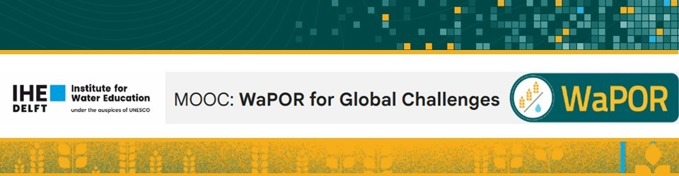

# WaPOR4Global

This repository supports IHE Delft's MOOC on [Global Challenges for Water in Agriculture](https://ocw.un-ihe.org/course/view.php?id=302), funded by the [second phase of WaPOR](https://www.fao.org/in-action/remote-sensing-for-water-productivity/). 

The course focusses on how WaPOR data can be used to monitor global challenges for water in agriculture. It will provide an introduction in the current global challenges of providing sufficient food, feed and fibre for a growing population and challenged by changing climatic conditions. It then dives into applications using the WaPOR data to assess, monitor and predict various aspects of water in agriculture for a location in Iraq. This starts with hands-on exercises for accessing WaPOR and other relevant datasets, applying different types of spatio- and temporal analyses and predict future conditions using the WaPOR data and finally visualising the results. The final assignment is to apply lessons learned for your own case study. 

This repository contains the following topics and associated Notebooks:
1. Accessing WaPOR data\
    a. [Notebook 1 Accessing WaPOR data](https://github.com/wateraccounting/WaPOR4Global/blob/main/1_Accessing_WaPOR_Data/Notebook_1_Accessing_WaPOR_data.ipynb)
2. Long times series analyses\
    a. [Notebook 2.1 Iraq timeseries analyses](https://github.com/wateraccounting/WaPOR4Global/blob/main/2_Long_Time_Series_Analyses/Notebook_2.1_Iraq_Timeseries_Analyses.ipynb)\
    b. [Notebook 2.2 Visualising timeseries analyses](https://github.com/wateraccounting/WaPOR4Global/blob/main/2_Long_Time_Series_Analyses/Notebook_2.2_Visualising_Timeseries_Analyses.ipynb)
3. Correlation analyses\
    a. [Notebook 3.1 Correlation analyses](https://github.com/wateraccounting/WaPOR4Global/blob/main/3_Correlation_Analyses/Notebook_3.1_Correlation_Analyses.ipynb)\
    b. [Notebook 3.2 Visualising correlation analyses](https://github.com/wateraccounting/WaPOR4Global/blob/main/3_Correlation_Analyses/Notebook_3.2_Visualising_Correlation_Analyses.ipynb)\
    c. [Notebook 3.3 Estimating Irrigated Areas using GEE](https://github.com/wateraccounting/WaPOR4Global/blob/main/3_Correlation_Analyses/Notebook_3.3_Estimating_irrigated_area_using_GEE.ipynb)\
    d. [Notebook 3.4 Creating WaPOR4Global dashboard](https://github.com/wateraccounting/WaPOR4Global/blob/main/3_Correlation_Analyses/Notebook_3.4_Dashboard_WaPOR4GlobalMOOC.ipynb)
4. Forecasting\
    a. [Notebook 4. Field level forecasting](https://github.com/wateraccounting/WaPOR4Global/blob/main/4_Forecasting/Notebook_4_Field_Level_Forecasting.ipynb)

It is recommended that you have completed the MOOC [Python for Geospatial analyses using WaPOR data](https://ocw.un-ihe.org/course/view.php?id=272&section=0) before starting this course.

This material is brought to you by the [Water Accounting Team at IHE Delft Institute for Water Education](https://wateraccounting.un-ihe.org/en/)

© 2024 IHE Delft Licenced under CC BY SA Creative Commons

** **
**For more on WaPOR applications check out these other courses:**

[Introduction to WaPORv3](https://ocw.un-ihe.org/course/view.php?id=263) (also available in [French](https://ocw.un-ihe.org/course/view.php?id=270) and [Spanish](https://ocw.un-ihe.org/course/view.php?id=269)) provides a brief introduction on the WaPOR database and how to access the data and do some simple analyses using QGIS.

[Python for Geospatial analyses using WaPOR data](https://ocw.un-ihe.org/course/view.php?id=272) provides an essential guide for using python for geospatial analyse using the WaPOR database. 

[Water Accounting and Water Productivity using WaPOR](https://ocw.un-ihe.org/course/view.php?id=92) (module 2 and 3) provides additional materials on how to implement water accounting and water productivity analyses using the WaPOR data (also available in [French](https://ocw.un-ihe.org/course/view.php?id=117) and [Arabic](https://ocw.un-ihe.org/course/view.php?id=118))

[WaPOR Concepts and Validation](https://ocw.un-ihe.org/course/view.php?id=214) provides more information regarding the concepts used to create the WaPOR data, as well as provide examples on how to validate the WaPOR data.

[Water Productivity in Practice](https://ocw.un-ihe.org/course/view.php?id=153) provides more information about the concept of water productivity and ways to improve it

[Water Accounting and Auditing](https://ocw.un-ihe.org/course/view.php?id=194) provides more information about the concepts of water accounting and auditing and tools how to generate water accounts (also available in [French](https://ocw.un-ihe.org/course/view.php?id=195))

More courses are available on the [OpenCourseWare platform](https://ocw.un-ihe.org) of [IHE Delft Institute for Water Education](https://un-ihe.org)

